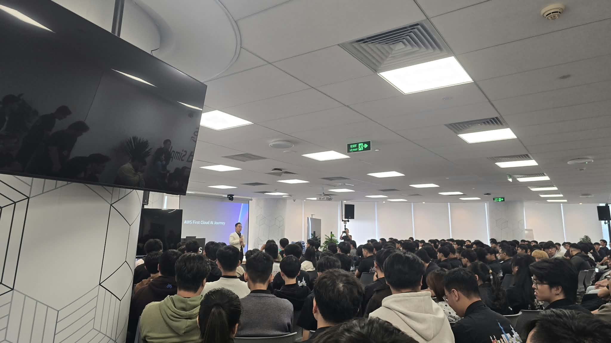
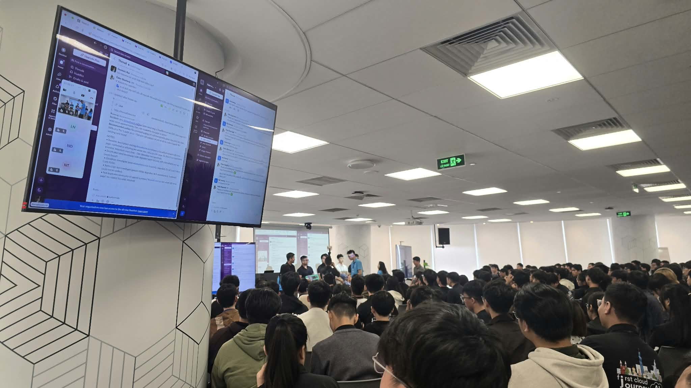
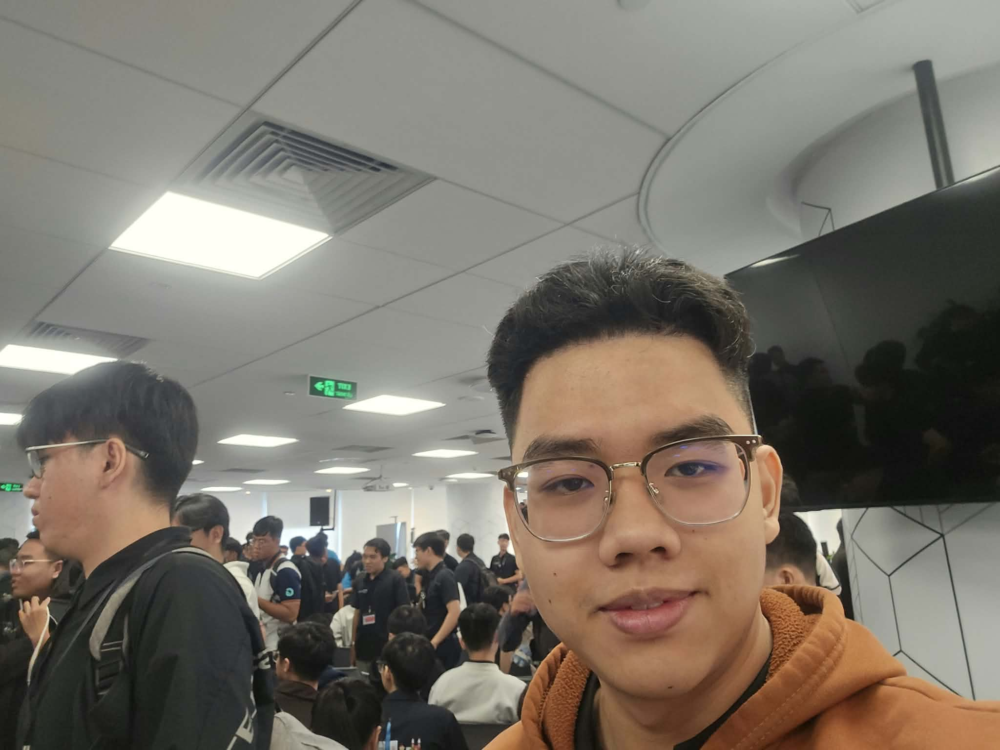

# Báo Cáo Tổng Kết: “BUILDRATHON KICKOFF: CODE THE FUTURE WITH CMC GLOBAL”

### Mục Tiêu Sự Kiện

- Nhấn mạnh việc thực hành (building) thay vì chỉ học thụ động thông qua một lộ trình phát triển sản phẩm có cấu trúc.
- Thúc đẩy sự phát triển kỹ thuật chuyên sâu thông qua việc hướng dẫn (mentoring) tận tình, các buổi gặp mặt hàng tuần và các cột mốc theo giai đoạn.
- Kết nối nhân tài công nghệ với các đối tác nghề nghiệp tiềm năng lâu dài và mạng lưới AWS builder.
- Xây dựng hồ sơ năng lực (portfolio) thực tế bằng cách hướng dẫn các đội từ giai đoạn thiết kế kiến trúc ban đầu đến triển khai sản phẩm đã được xác minh.

### Diễn Giả

- **Truong Bui** – Tech Lead, CMC Global 
- **Phuong Pham** – Program Manager, FCAJ
- **Thien Lu** – Program Manager, FCAJ

### Điểm Nổi Bật Chính

#### Thử Thách Thực Hành AI Agent: "Triage Bot" (Bot Phân Loại)

- **Tự động hóa bất đồng bộ**: Minh họa thực tế về một AI agent hoạt động "trong khi bạn ngủ".
- **Luồng công việc**:
    - **Thu thập**: Bot tự động quét các trình theo dõi vấn đề (issue trackers) để tìm lỗi hoặc yêu cầu mới.
    - **Phân tích & Đề xuất**: Bot đối chiếu vấn đề với các vé đã giải quyết trong quá khứ và tài liệu codebase để đề xuất các bản sửa lỗi tiềm năng.
    - **Báo cáo**: Bot tổng hợp một báo cáo buổi sáng có cấu trúc và được phân loại mức độ ưu tiên (qua Slack/Email) để lập trình viên xem xét, phê duyệt hoặc tinh chỉnh khi thức dậy.

#### Sự Nghiệp & Cộng Đồng trong Mảng Cloud & AI
- **Thông tin chi tiết từ ngành**: Các case study thực tế từ CMC Global và các chuyên gia AWS về cách các tổ chức đang áp dụng Agentic AI để giải quyết các thách thức kinh doanh.
- **Chứng chỉ & Phát triển**: Các lộ trình để lập trình viên nâng cao kỹ năng và lấy các chứng chỉ về AWS Cloud và Generative AI.

### Những Điểm Chốt Quan Trọng

#### Tư Duy Thiết Kế

- **Ưu tiên vấn đề, AI thứ hai (Problem-First, AI-Second)**: Luôn bắt đầu từ nỗi đau của doanh nghiệp (ví dụ: tình trạng kiệt sức của lập trình viên do phải phân loại vấn đề thủ công) thay vì ép buộc một giải pháp công nghệ.  
- **Con người trong vòng lặp (Human-in-the-Loop)**: AI agent nên hỗ trợ (augment) lập trình viên, không thay thế họ. Bot đề xuất các bản sửa lỗi, nhưng lập trình viên vẫn giữ quyền xem xét và phê duyệt cuối cùng.  
- **Ngôn ngữ phổ quát (Ubiquitous Language)**: Đảm bảo các bên liên quan trong doanh nghiệp và kỹ sư AI có chung một vốn từ vựng rõ ràng khi định nghĩa những gì AI agent được phép làm. 

#### Kiến Trúc Kỹ Thuật

- **Các trigger AI hướng sự kiện (Event-Driven AI Triggers)**: Sử dụng kiến trúc hướng sự kiện bất đồng bộ (ví dụ: EventBridge kích hoạt một hàm Lambda) để đánh thức AI agent chỉ khi có vấn đề mới được tạo, giúp tối ưu hóa chi phí và hiệu suất.

#### Chiến Lược Hiện Đại Hóa

- **Áp dụng AI theo giai đoạn**: Bắt đầu với một use case hẹp, ROI cao (như Triage Bot) trước khi mở rộng sang các agent CI/CD hoặc triển khai hoàn toàn tự động.
- **Đo lường ROI của AI**: Theo dõi các chỉ số như "thời gian tiết kiệm được cho mỗi lập trình viên mỗi tuần", "giảm thời gian giải quyết trung bình (MTTR)" và "mức độ hài lòng của lập trình viên". 

### Trải Nghiệm Sự Kiện

Tham gia **“Buildrathon Kickoff: Code the Future with CMC Global”** là một trải nghiệm cực kỳ giá trị, mang lại cho tôi cái nhìn toàn diện về việc xây dựng các giải pháp AI hiện đại và hiểu được ứng dụng thực tế của Agentic AI trên AWS. Những trải nghiệm chính bao gồm:

#### Học hỏi từ các diễn giả giàu chuyên môn
- Các chuyên gia từ CMC Global và AWS đã chia sẻ những best practices về điện toán đám mây, các xu hướng Generative AI và việc áp dụng AI vào thực tế.
- Thông qua buổi talkshow, tôi đã hiểu sâu hơn về cách các tổ chức đang tận dụng AWS và Agentic AI để giải quyết các thách thức kinh doanh phức tạp và thúc đẩy đổi mới sáng tạo.

#### Trải nghiệm kỹ thuật thực hành
- Giúp tôi hình dung cách xây dựng một giải pháp AI tự động từ đầu với sự hỗ trợ của mentor. 
- Khám phá luồng công việc thực tế của **"Morning Triage Bot"** tự động quét các issue tracker, phân tích dữ liệu lịch sử và đề xuất các bản sửa lỗi code tiềm năng.  
- Hiểu được ứng dụng thực tế của **Retrieval-Augmented Generation (RAG)**, prompt engineering và knowledge bases để đảm bảo các phản hồi của AI dựa trên dữ liệu chính xác và đặc thù của doanh nghiệp.

#### Những bài học rút ra
- Việc áp dụng **RAG và các trigger hướng sự kiện** giúp giảm thời gian phân loại thủ công đồng thời cải thiện đáng kể độ chính xác và khả năng nhận biết ngữ cảnh của các giải pháp do AI tạo ra. 
- Tích hợp AI agent vào vòng đời phát triển phần mềm (SDLC) hàng ngày có thể biến các quy trình làm việc thụ động, tốn thời gian thành các quy trình chủ động, tinh gọn, giúp tăng tốc độ tổng thể của nhóm.

#### Một số hình ảnh tại sự kiện

> Nhìn chung, sự kiện không chỉ cung cấp kiến thức kỹ thuật mà còn giúp tôi định hình lại tư duy về thiết kế AI, hiện đại hóa hệ thống và sự hợp tác giữa các nhóm.