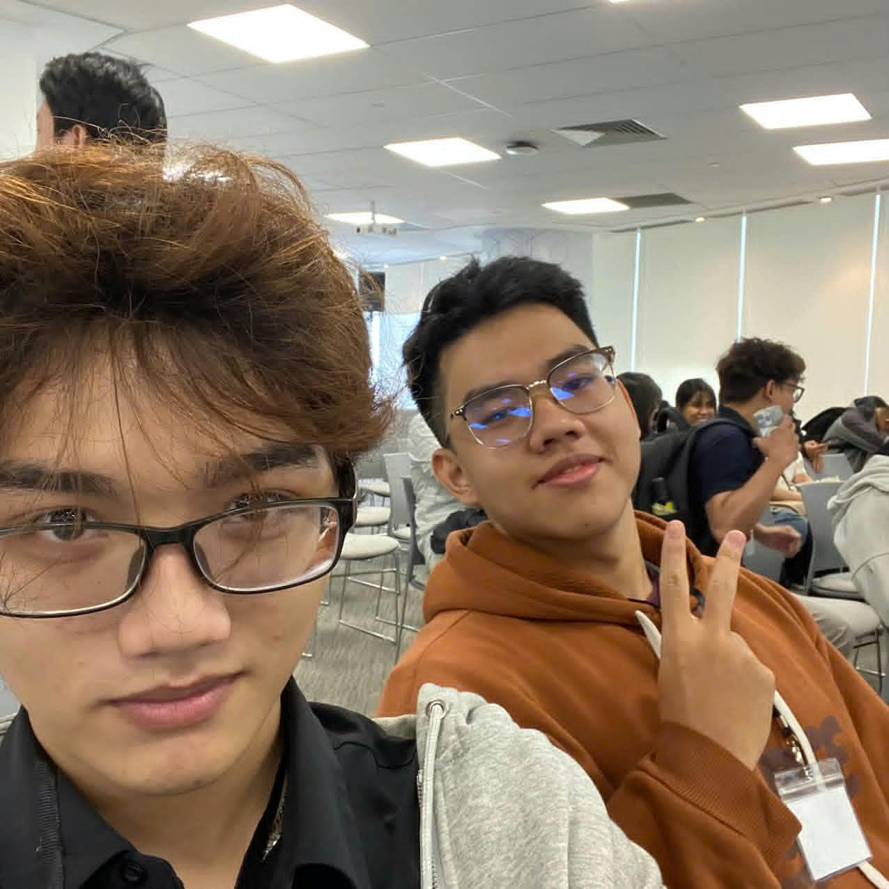
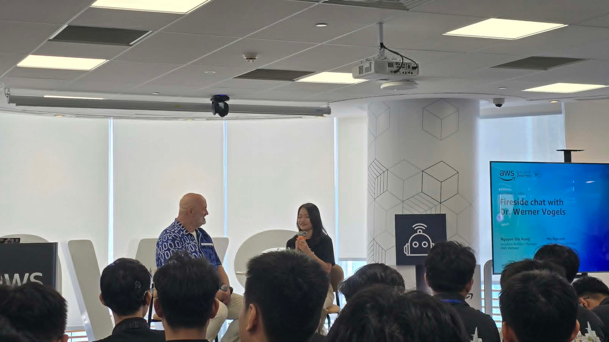
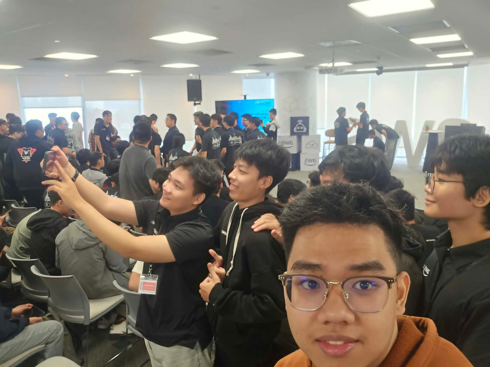

# Summary Report: Navigating the Future of Cloud & AI in Vietnam

### Event Objectives

- Explore how the rise of generative AI is reshaping the daily responsibilities and long-term value of software engineers.
- Unpack foundational AWS design philosophies around scalability, resilience, and operational discipline.
- Define the evolving skill set required to thrive as a modern engineer (the "Renaissance Developer").
- Establish a realistic perspective on AI as a productivity multiplier rather than a replacement for human expertise.

### Speakers

- **Dr. Werner Vogels** – Chief Technology Officer and Vice President, Amazon & AWS

### Key Highlights

#### Scaling Pains and the Birth of Custom Infrastructure
- **The Breaking Point:** A massive holiday-season database crash at early Amazon resulted in a full day of downtime and severe financial impact.  
- **The Discovery:** A deep dive into traffic patterns revealed that the vast majority of database calls were trivial key-value lookups, not complex relational queries.  
- **The Innovation:** Instead of forcing a generic enterprise database to handle hyper-scale workloads, Amazon engineered its own distributed key-value system, laying the groundwork for Dynamo and DynamoDB.  
- **Core Lesson:** At massive scale, off-the-shelf tools often become bottlenecks. True innovation sometimes requires building bespoke solutions tailored to your specific access patterns.

#### Core Principles of Reliable Systems
- **Focus on the Tail End:** Average latency metrics hide poor user experiences. Engineering teams must optimize for the 99.9th percentile (P99.9) to guarantee consistent performance.  
- **Assume Inevitable Failure:** Architectures must be built with the baseline assumption that hardware, networks, and data centers will fail, and the system must survive gracefully.  
- **Proactive Chaos Testing:** "GameDays" are mandatory drills where production environments are intentionally disrupted to validate automated failover and recovery processes without human intervention.  
- **Customer-Aligned Economics:** The shift to pay-as-you-go cloud models forces providers to continuously prove their value, aligning vendor success directly with customer reliability.

#### The "Renaissance Developer" Profile
- **Relentless Curiosity:** Treating the rapid evolution of frameworks and languages as an opportunity for lifelong learning, not a burden.  
- **Holistic Systems View:** Zooming out from isolated code modules to understand how data and services flow across the entire ecosystem.  
- **Ultimate Accountability:** AI might draft the code, but the human engineer remains fully accountable for security flaws, production outages, and architectural soundness.  
- **T-Shaped Competency:** Combining deep expertise in a primary domain with functional literacy in adjacent areas (e.g., frontend, data modeling, business logic).  
- **Strategic Communication:** Translating technical trade-offs into business terms, ensuring that engineering decisions solve actual business problems rather than just chasing trends.

#### The Human-AI Dynamic
- **AI as a Force Multiplier:** Generative AI acts like a highly productive but imperfect compiler. It drastically shrinks prototyping time but cannot be trusted blindly.  
- **The Irreplaceable Human Element:** Critical thinking, ethical judgment, creative problem-solving, and an understanding of edge cases remain strictly human domains.  
- **A Warning on Stagnation:** Echoing Grace Hopper, the greatest risk to a tech career is the comfort of "We've always done it this way."

### Key Takeaways

#### Strategic Mindset
- **Own the Outcome:** Delegation to AI does not mean delegation of responsibility.  
- **Question Legacy Habits:** Regularly audit existing processes to ensure they aren't just artifacts of past limitations.  
- **Think in Systems:** Optimize the entire value stream, not just individual components.  

#### Architectural Discipline
- **Measure the Worst-Case:** Shift monitoring dashboards to highlight P99/P99.9 latency to uncover hidden friction.  
- **Automate Resilience:** Recovery from failure should be a programmed response, not a manual scramble.  
- **Right-Size the Tech:** Match the database and compute technology to the actual shape of the workload, not the other way around.  

#### Career & Team Strategy
- **Broaden Your Horizons:** Encourage cross-training within the team to build T-shaped skill sets.  
- **Use AI for Drafting, Humans for Review:** Leverage AI for boilerplate and initial scaffolding, but enforce strict human-led reviews for security and logic.  

### Applying to Work

- **Initiate a "GameDay":** Propose a controlled failure simulation for our current staging environment to test our alerting and auto-recovery mechanisms.  
- **Audit Monitoring Dashboards:** Review our current observability setup and add P99.9 latency tracking for our most critical user journeys.  
- **Re-evaluate Database Usage:** Analyze our current data access patterns to see if any heavy relational workloads could be optimized with a simpler key-value or document store.  
- **Facilitate Cross-Team Syncs:** Organize brief knowledge-sharing sessions where engineers explain technical constraints to product managers, fostering a shared vocabulary.  
- **Standardize AI-Assisted Reviews:** Update our PR guidelines to explicitly require human validation of AI-generated code, focusing on edge cases and security implications.  

### Event Experience

Attending Dr. Werner Vogels’ keynote was a refreshing and grounding experience. Rather than hyping AI as a magic bullet, the session provided a mature, historically grounded perspective on how technology evolves and how engineers must evolve with it. 

#### Insights from a Industry Veteran
- Hearing the firsthand account of Amazon’s early database struggles made the concept of "building vs. buying" much more tangible. It highlighted that true architectural breakthroughs often come from deeply understanding your own unique constraints.  
- The emphasis on **operational excellence** reinforced that reliability is not an afterthought; it is a deliberate, continuously practiced discipline.  

#### Conceptual Takeaways
- The **P99.9 latency** concept was a major "aha" moment. It completely shifts how I view performance metrics, moving the focus from "mostly working" to "consistently working for everyone."  
- The **GameDay** methodology provides a concrete, actionable framework for building confidence in our system's resilience, rather than just hoping it holds up under pressure.  

#### Reframing the AI Narrative
- The session directly addressed my own underlying anxieties about AI automation. Framing AI as an "imprecise compiler" was a brilliant analogy. It clarified that my value as an engineer isn't in typing syntax, but in applying judgment, context, and accountability to the output.  

#### Networking and Broader Perspective
- Discussions with peers after the talk highlighted a shared desire to bridge the gap between engineering and business units. The "Renaissance Developer" model gives us a clear target for the soft skills and cross-functional knowledge we need to cultivate.  

#### Personal Lessons Learned
- Complacency is the real enemy, not AI. Sticking to legacy patterns because they are comfortable is a greater career risk than adopting new tools.  
- Resilience must be engineered and tested, not assumed.  
- The most powerful tool in an engineer's arsenal remains their ability to communicate complex trade-offs clearly to non-technical stakeholders.  

#### Some event photos

> Ultimately, this about enduring engineering principles. It left me feeling empowered to take greater ownership of my systems, leverage AI thoughtfully, and continuously challenge the status quo in my daily work.